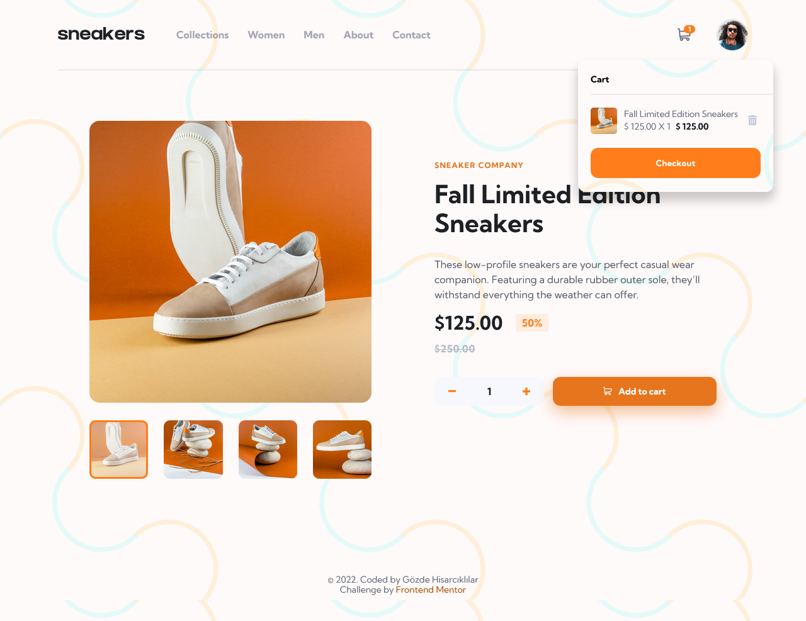

# Frontend Mentor - E-commerce product page solution

This is a solution to the [E-commerce product page challenge on Frontend Mentor](https://www.frontendmentor.io/challenges/ecommerce-product-page-UPsZ9MJp6). Frontend Mentor challenges help you improve your coding skills by building realistic projects.

* Front-end code for the Ecommerce product app that let users to preview a product through the gallery/lightbox and enables user to use cart functionalities such as adding and removing items

## Table of contents

- [Overview](#overview)
  - [The challenge](#the-challenge)
  - [Screenshot](#screenshot)
  - [Links](#links)
- [My process](#my-process)
  - [Built with](#built-with)
  - [What I learned](#what-i-learned)
  - [Continued development](#continued-development)
- [Author](#author)

## Overview

### The challenge

Users should be able to:

- View the optimal layout for the site depending on their device's screen size
- See hover states for all interactive elements on the page
- Open a lightbox gallery by clicking on the large product image
- Switch the large product image by clicking on the small thumbnail images
- Add items to the cart
- View the cart and remove items from it

### Screenshot

  
  

### Links

- Solution URL: [Git repository](https://github.com/GozdeHisarckllar/challenge-ecommerce-product-page)
- Live Site URL: [Git Pages](https://gozdehisarckllar.github.io/challenge-ecommerce-product-page/)

## My process

* I created and tried to use reusable custom components as much as possible, especially for the lightbox/gallery and navbar components.

* By creating a list of sample data objects, I tried to create a simulation of the case as if the data was fetched from an API. I adjusted some custom components, in order to make it became more compatible to display possible additional data. (For instance, I refined some code for shopping cart updates and gallery/lightbox. Still, React Routers and other product pages are required to be created and some necessary adjustments such as using the map() function for rendering product pages and showing data should be made as well).

* After adding media-queries in the final steps, I made the page components responsive to desktop, tablet and mobile viewports.

### Built with

- Semantic HTML5 and JSX markup
- CSS3
- Flexbox
- CSS Grid
- BEM methodology
- ES6 features
- [React](https://reactjs.org/) - JS library

### What I learned

Throughout the project, I faced some new challenges and learning oppotunities while coming up with possible solutions to some cases such as gallery/slider functionalities & animations, updating context of an inner object of a state variable. I really enjoyed the process of both learning and contemplating, finding out solutions and then testing my solutions by considering different possible cases that an app user can encounter.

### Continued development

I am plannig to continue focusing on coding different types of gallery or slider designs. Also, I would like to create a project with additional product pages on the frontend and product data fetched from the backend.

## Author

- Github - [Gözde Hisarcıklılar](https://github.com/GozdeHisarckllar)
- Twitter - [@gzdehsr](https://www.twitter.com/gzdehsr)
